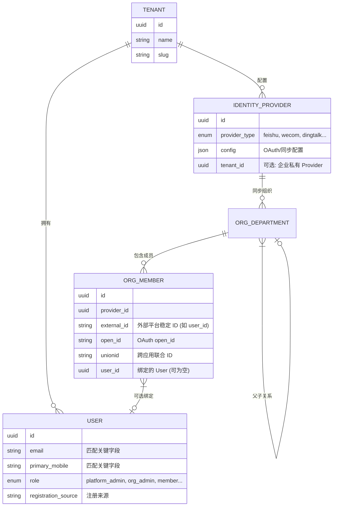

# 用户身份系统重构架构文档

## 1. 概述

为了支持多平台（飞书、钉钉、企微、SAML 等）集成以及更灵活的企业级用户管理，Clawith 对用户中心进行了底层架构重构。核心目标是将“平台账号（User）”与“外部组织成员（OrgMember）”解耦，并通过 IdentityProvider 统一管理各类外部身份源与组织同步。

本版本不再使用 `UserIdentity` / `ExternalUserProfile` 中间表，外部身份以 `OrgMember` 作为统一承载，并通过 `OrgMember.user_id` 与平台用户关联。

## 2. 核心架构设计

新架构采用“平台账号 + 外部组织成员”双实体模型：

- `IdentityProvider`：外部身份源配置（OAuth 密钥、组织同步配置等）。
- `OrgDepartment` / `OrgMember`：同步后的组织架构与成员数据（外部身份承载体）。
- `User`：平台内部账号。
- `OrgMember.user_id`：可选，表示已绑定到平台用户。

### 2.1 实体关系图 (ER Diagram)

## 3. 业务场景解析

### 3.1 平台注册用户 (Platform Registered User)
- **来源**：通过 Web 页面/手机验证码注册。
- **逻辑**：创建 `User` 记录，其 `registration_source` 为 `web`。
- **关联**：若组织同步已存在匹配成员（同邮箱/手机号），会绑定到 `OrgMember.user_id`。

### 3.2 第三方同步用户 (组织同步)
- **同步流程**：
  1. 后台通过配置的 `IdentityProvider` 拉取组织结构与成员。
  2. 将外部成员落表为 `OrgMember`（保存 `external_id/open_id/unionid` 等）。
  3. 通过邮箱/手机号尝试绑定到已有 `User`，否则保持未绑定状态。

### 3.3 SSO 登录/身份绑定
- **登录逻辑**：SSO 回调后优先通过 `OrgMember` 中的 `unionid/external_id/open_id` 解析用户。
- **绑定逻辑**：用户可以绑定多个外部身份来源（多 Provider）。
- **优势**：即使企业从飞书迁移到钉钉，平台 `User` 不变，资产与历史数据可保留。

## 4. 角色与权限

- `platform_admin`：平台管理员，管理租户、系统配置。
- `org_admin`：租户管理员，管理企业级配置与组织同步。
- `agent_admin`：管理企业内 Agent 与资源。
- `member`：普通成员。

## 5. 关键设计点：身份匹配与去重

1. **优先级**：`unionid/external_id/open_id` -> `email` -> `mobile`。
2. **去重策略**：数据库侧以 `(tenant_id, email)` 与 `(tenant_id, primary_mobile)` 进行唯一性约束（允许 NULL）。
3. **解耦**：`OrgMember` 与 `User` 不强制一对一绑定，允许先同步、后绑定。

---
*文档版本：v1.1*
*日期：2026-03-27*
